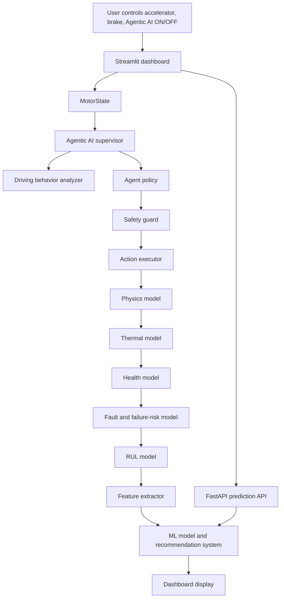

# EV Motor Digital Twin With ML Predictive Maintenance and Agentic AI Guardian

## 1. Project Overview

This project is a real-time EV motor digital twin. A digital twin is a software model that represents the behavior of a real physical system. In this project, the physical system is an electric vehicle traction motor and its connected vehicle dynamics, thermal behavior, health degradation, predictive maintenance layer, and autonomous safety supervisor.

The final system contains:

- A real-time EV motor simulation.
- A physics model for speed, torque, power, voltage, current, battery SOC, and efficiency.
- A part-wise thermal model for stator, rotor, rotor magnet, and bearing temperature.
- A continuous health model for stator, rotor, magnet, bearing, cooling, shaft, and overall motor health.
- A continuous failure probability model.
- Remaining useful life prediction.
- Local Random Forest ML predictive maintenance.
- Deterministic safety-rule override for ML results.
- Maintenance recommendation system.
- Agentic AI Guardian ON/OFF mode.
- Driver behavior warnings.
- Automatic torque derating, speed limiting, cooling boost, limp mode, and thermal emergency stop.
- FastAPI backend protected by a custom API key.
- Streamlit dashboard deployed on Render.

The project started as a machine-learning based predictive maintenance idea and was upgraded step by step into a self-protecting EV motor digital twin.

## 2. Project Motive

Electric vehicles depend heavily on the traction motor, inverter, battery, cooling loop, and drivetrain control. If the motor runs under too much heat, vibration, electrical stress, or poor cooling, it may lose efficiency or suffer permanent damage.

The motive of this project is to create a realistic and understandable digital twin that can:

1. Simulate how an EV motor behaves while driving.
2. Monitor real-time values like torque, RPM, speed, current, temperatures, health, failure risk, and RUL.
3. Predict faults using machine learning.
4. Recommend what should be done when a fault or degradation appears.
5. Add Agentic AI behavior so the system does not only warn the user but also takes safe corrective actions.

The key idea is:

> Predictive maintenance tells us what may fail. Agentic protection helps prevent the damage from becoming worse.

## 3. Problem Statement

Normal dashboards only show values. They may show temperature, current, speed, and health, but they do not automatically protect the system.

The problem this project solves is:

- How can we simulate a real EV motor in software?
- How can we track motor health continuously instead of only after a fault occurs?
- How can we predict possible motor failures?
- How can the system recommend maintenance actions?
- How can an Agentic AI Guardian automatically reduce risk by controlling torque, speed, cooling, and braking?

## 4. Main Objectives

The main objectives are:

1. Build an EV motor digital twin using physics and thermal modeling.
2. Use ML for predictive maintenance.
3. Replace external Gemini dependency with a local deployed prediction API.
4. Protect the API with a custom `APP_API_KEY`.
5. Deploy the API and dashboard on Render.
6. Add a real-time dashboard for monitoring and control.
7. Add recommendation logic for maintenance.
8. Add Agentic AI ON/OFF control.
9. Make the motor behavior more like a real compact EV.
10. Make health and failure probability change continuously.
11. Add emergency stop when temperatures become dangerously high.

## 5. Final System Links

Dashboard:

`https://ev-motor-digital-twin-dashboard.onrender.com`

API:

`https://ev-motor-digital-twin-api.onrender.com`

API health endpoint:

`https://ev-motor-digital-twin-api.onrender.com/health`

API docs:

`https://ev-motor-digital-twin-api.onrender.com/docs`

## 6. High-Level Architecture



The architecture follows a safety-first design:

- The agent observes the motor state.
- The policy proposes actions.
- The safety guard validates actions.
- The executor applies only safe actions.
- The physics and thermal models update the motor state.
- The dashboard explains what happened.

## 7. Technology Stack

Main language:

- Python

Backend:

- FastAPI
- Uvicorn
- Pydantic

Frontend:

- Streamlit

Machine learning:

- Scikit-learn
- Joblib
- Pandas
- NumPy

Deployment:

- Render Blueprint
- GitHub repository
- `render.yaml`

Testing:

- Pytest
- Streamlit testing utilities
- FastAPI TestClient

Security:

- Custom API key using `APP_API_KEY`
- `X-API-Key` HTTP header
- `.env` ignored from Git

## 8. Technical Requirements

To run the project locally:

1. Python 3.12 or compatible runtime.
2. Dependencies from `requirements.txt`.
3. Model artifacts inside `models/`:
   - `best_model.pkl`
   - `scaler.pkl`
   - `label_encoder.pkl`
   - `feature_columns.pkl`
   - `model_uses_scaler.pkl`
4. Environment variables:
   - `APP_API_KEY`
   - `API_BASE_URL` for the dashboard if calling a remote API.

Example local API run:

```bash
uvicorn api:app --host 0.0.0.0 --port 8000
```

Example local dashboard run:

```bash
streamlit run motor/dashboard.py
```

Example tests:

```bash
python -m pytest
```

## 9. EV Motor Theory Used in This Project

### 9.1 EV Traction Motor

The project models an IPMSM-style EV traction motor. IPMSM means Interior Permanent Magnet Synchronous Motor. This type of motor is widely used in electric vehicles because it has:

- High efficiency.
- High torque density.
- Good control at different speeds.
- Strong regenerative braking capability.

The simulated motor is aligned with a compact EV class:

- Nominal voltage: 400 V.
- Peak power: 160 kW.
- Peak torque: 340 Nm.
- Battery capacity: 62 kWh.
- Maximum vehicle speed: about 150 km/h.
- Motor speed range: above 10,000 RPM.

### 9.2 Torque, Speed, and Power

Mechanical power is calculated using:

```text
omega = 2 * pi * rpm / 60
power_kw = torque_nm * omega / 1000
```

At low speed, EV motors can produce high torque. At high speed, torque must reduce because power is limited. This is why the project uses a torque envelope:

- Constant torque at low speed.
- Constant power at high speed.

This prevents the simulation from producing unrealistic power above the configured 160 kW limit.

### 9.3 Vehicle Dynamics

Vehicle speed is updated using:

```text
drive_force = motor_torque * gear_ratio * driveline_efficiency / wheel_radius
road_load = rolling_resistance + aerodynamic_drag
net_force = drive_force - road_load
acceleration = net_force / vehicle_mass
```

The model includes:

- Gear ratio.
- Wheel radius.
- Vehicle mass.
- Rolling resistance.
- Aerodynamic drag.
- Top speed limiter.

### 9.4 Electrical Losses

The model calculates:

- Back EMF.
- Copper loss.
- Iron loss.
- Mechanical loss.
- Total loss.
- Efficiency.

Copper loss is based on current:

```text
copper_loss = 3 * current^2 * stator_resistance
```

This matters because current creates heat, and heat reduces health.

### 9.5 Battery Behavior

The model estimates:

- SOC drop from energy usage.
- Voltage sag under current.
- Regen charging during braking.

Voltage does not jump instantly. It moves gradually using a first-order response, which makes the dashboard behave more like real hardware.

### 9.6 Thermal Theory

The thermal model is part-wise. It tracks:

- Stator temperature.
- Rotor temperature.
- Magnet temperature.
- Bearing temperature.

Heat comes from motor losses. Cooling depends on:

- Coolant flow rate.
- Difference between part temperature and coolant temperature.
- Thermal mass of each part.

This is more realistic than a fixed cooling subtraction because real cooling removes more heat when parts are hotter.

### 9.7 Health Theory

Health is calculated continuously from operating stress.

Subsystem health includes:

- Stator health.
- Rotor health.
- Magnet health.
- Bearing health.
- Cooling health.
- Shaft health.

Overall health is a weighted average:

```text
overall_health =
    0.25 * stator_health
  + 0.15 * rotor_health
  + 0.15 * magnet_health
  + 0.20 * bearing_health
  + 0.15 * cooling_health
  + 0.10 * shaft_health
```

The latest upgrade made health continuous, so it no longer stays fixed until a hard fault.

### 9.8 Failure Probability Theory

Failure probability is a continuous risk score.

Inputs include:

- Stator temperature.
- Rotor temperature.
- Magnet temperature.
- Bearing temperature.
- Vibration.
- Coolant flow.
- Insulation resistance.
- Current harmonics.
- Overall health.
- Current and torque stress.

This means failure risk can rise gradually from 0 before a major fault occurs.

### 9.9 Remaining Useful Life

RUL is reduced by:

- Poor health.
- High failure probability.
- Temperature stress.
- Vibration stress.
- Fault stress.

The system immediately caps RUL when health or failure risk becomes poor, so it does not keep showing a healthy maximum during a dangerous condition.

## 10. Agentic AI Guardian Theory

Agentic AI means the system does more than display data. It observes the environment, reasons about the condition, selects actions, and applies them through tools.

In this project:

- Environment = EV motor digital twin.
- Agent observations = motor state, driver inputs, health, risk, faults, temperatures.
- Agent actions = torque limit, speed limit, cooling boost, brake smoothing, limp mode, thermal stop.
- Safety guard = validates actions before they affect the motor.
- Executor = converts safe actions into control commands.

The Agentic AI can be turned:

- `OFF`: It warns but does not control.
- `ON`: It can take safe corrective action.

### 10.1 Agentic Decision Rules

| Situation | Condition | Agent Action |
| --- | --- | --- |
| Early thermal rise | Any temperature enters watch band | Boost cooling and warn driver |
| High thermal load | Temperature is high | Boost cooling, reduce torque, limit speed |
| Critical overheating | Temperature reaches critical band | Maximum cooling, torque derating, speed limit, limp mode |
| Thermal emergency stop | Temperature reaches emergency band | Warn user, remove drive torque, gradually stop vehicle |
| Cooling failure | Coolant flow weak | Max cooling request, derate torque, cap speed |
| Bearing/vibration risk | Bearing hot or vibration high | Reduce torque, limit speed, limp mode |
| Magnet protection | Magnet temperature high | Boost cooling and reduce torque |
| Electrical protection | Insulation low or harmonics high | Reduce current demand and warn for inspection |
| Bad pedal usage | Accelerator and brake together | Block acceleration while braking |
| Harsh launch | High acceleration at low speed | Derate torque and prevent current spikes |
| High failure probability | Failure risk high | Prioritize damage prevention |

### 10.2 Thermal Emergency Stop

If temperature becomes very high:

- Stator >= 150 deg C.
- Rotor >= 135 deg C.
- Magnet >= 145 deg C.
- Bearing >= 110 deg C.

Then Agentic AI:

1. Shows a thermal emergency reminder.
2. Sets cooling to maximum.
3. Removes drive torque.
4. Gradually reduces the speed target.
5. Applies controlled braking/regeneration.
6. Stops the car.
7. Shows stop complete and inspection message.

This is intentionally gradual, not instant, because a real vehicle should avoid sudden unsafe stopping unless it is an emergency braking case.

## 11. ML Predictive Maintenance

The ML model is a Random Forest classifier saved as `models/best_model.pkl`.

Supporting artifacts:

- `scaler.pkl`
- `label_encoder.pkl`
- `feature_columns.pkl`
- `model_uses_scaler.pkl`

The ML flow:

1. Extract live features from `MotorState`.
2. Arrange features in the same order used during training.
3. Apply scaler if the model requires it.
4. Predict fault class.
5. Calculate confidence if the model supports probabilities.
6. Apply safety-rule override if live rules detect a fault.
7. Return health, failure risk, RUL, anomalies, and recommendations.

Important design decision:

The Random Forest model is useful, but deterministic safety rules are final authority. If the model predicts `NONE` but the safety model detects a bearing fault, the final diagnosis becomes the safety-rule fault.

## 12. Recommendation System

The recommendation system explains:

- Affected part.
- Issue.
- Immediate action.
- Fix/maintenance step.
- Severity.

Examples:

- Bearing fault: stop motor, inspect bearing lubrication, alignment, and mounting.
- Cooling failure: check pump, coolant level, filter, leaks, radiator, and air pockets.
- Magnet overheating: stop high-load operation and restore cooling.
- Insulation risk: isolate power and inspect wiring/windings.

Recommendations come from live features and ML/safety diagnosis.

## 13. API Design

The API is built with FastAPI.

Main endpoints:

- `GET /`: service status.
- `GET /health`: health check for Render.
- `POST /predict`: protected prediction endpoint.

The `POST /predict` endpoint requires:

```text
X-API-Key: YOUR_APP_API_KEY
```

The API validates input with Pydantic and then calls:

```python
run_motor_twin(**data.model_dump())
```

The response contains:

- `motor_state`
- `ml_prediction`

## 14. Dashboard Design

The dashboard is built with Streamlit.

Sidebar controls:

- Accelerator slider.
- Brake slider.
- Agentic AI ON/OFF.
- Start.
- Stop.
- Reset.
- Predict ML Health.

Displayed dashboard sections:

- Live Motor Metrics.
- Thermal Condition.
- Health and Maintenance.
- Agentic EV Motor Guardian.
- Driving Behavior Warnings.
- Guardian Actions.
- Agentic AI Decision Rules.
- Recommended Action.
- ML Predictive Maintenance.

The dashboard runs a real-time loop:

```text
read controls
calculate elapsed time
run Agentic AI supervisor
apply safe actions
update physics
update thermal state
update health
update faults/failure risk
update RUL
refresh dashboard
```

## 15. Development Timeline

The project was built step by step:

1. `0c8b5e5` - Initial EV Motor Digital Twin API.
2. `80e9547` - Removed cache files.
3. `6290dee` - Deployed authenticated local ML prediction API.
4. `655cb56` - Added deployed EV motor monitoring dashboard.
5. `5b1ad7e` - Fixed dashboard imports on Render.
6. `6ac203f` - Fixed motor acceleration and live metrics.
7. `aa58c76` - Added retry behavior for Render cold starts.
8. `c072d44` - Added CORS support to API.
9. `129bfee` - Aligned health diagnostics and added prediction fallback.
10. `3861b17` - Added motor maintenance recommendations.
11. `3a14533` - Added real-time Agentic Motor Guardian.
12. `359c61e` - Simplified Agentic AI to ON/OFF protection toggle.
13. `095e045` - Improved real-time EV thermal behavior.
14. `5542a47` - Aligned drivetrain with real EV behavior.
15. `bc77ab9` - Added Agentic thermal emergency stop.
16. `58ab323` - Made health and failure risk continuous.

## 16. File-by-File Code Explanation

### 16.1 `api.py`

Purpose:

- Creates the FastAPI application.
- Defines request schema using `MotorInput`.
- Protects `/predict` using `APP_API_KEY`.
- Exposes health endpoint for Render.

Important logic:

- `require_api_key()` reads the server's `APP_API_KEY`.
- It compares the incoming `X-API-Key` using `secrets.compare_digest`.
- If key is missing or wrong, it returns HTTP 401.
- If the server has no key configured, it returns HTTP 503.

### 16.2 `motor_service.py`

Purpose:

- Connects API request data to the motor simulation pipeline.

Flow:

1. Create `MotorState`.
2. Update physics.
3. Update thermal model.
4. Update health.
5. Update faults.
6. Update RUL.
7. Extract features.
8. Run ML prediction.
9. Return state and prediction.

### 16.3 `render.yaml`

Purpose:

- Defines Render Blueprint deployment.

Services:

- `ev-motor-digital-twin-api`
- `ev-motor-digital-twin-dashboard`

Environment variables:

- `PYTHON_VERSION`
- `APP_API_KEY`
- `API_BASE_URL`

### 16.4 `generate_api_key.py`

Purpose:

- Generates a secure random key for `APP_API_KEY`.

### 16.5 `motor/motor_state.py`

Purpose:

- Defines the central state object used everywhere.

It stores:

- Electrical values.
- Vehicle values.
- Thermal values.
- Vibration values.
- Health values.
- Fault values.
- Agentic AI state.
- Internal filtered torque.

Almost every module receives and returns this `MotorState`.

### 16.6 `motor/motor_params.py`

Purpose:

- Stores motor and vehicle constants.

Important values:

- IPMSM motor type.
- 400 V nominal system.
- 110 kW nominal power.
- 160 kW peak power.
- 340 Nm peak torque.
- 62 kWh battery equivalent in physics model.
- 150 km/h speed range.
- Cooling and thermal limits.

### 16.7 `motor/motor_physics.py`

Purpose:

- Simulates drivetrain and electrical behavior.

It calculates:

- RPM to speed.
- Speed to RPM.
- Road load.
- Acceleration.
- Power.
- Current.
- Voltage sag.
- Battery SOC.
- Regenerative braking.
- Copper, iron, mechanical, and total losses.
- Efficiency.

Important realism features:

- First-order torque response.
- Power-limited torque envelope.
- 160 kW peak power cap.
- Road load from rolling resistance and aerodynamic drag.
- Voltage sag under load.

### 16.8 `motor/motor_thermal.py`

Purpose:

- Simulates part-wise motor temperature.

Parts:

- Stator.
- Rotor.
- Magnet.
- Bearing.

Each part has:

- Loss fraction.
- Thermal mass.
- Cooling coefficient.
- Coupling to other parts.

The model uses:

```text
net_heat = heat_input + coupled_heat - cooling
temperature_change = net_heat / thermal_mass * dt
```

Cooling increases when:

- Coolant flow increases.
- Part temperature is much higher than coolant temperature.

### 16.9 `motor/motor_health.py`

Purpose:

- Converts stress into subsystem health scores.

It penalizes:

- High stator temperature.
- High rotor temperature.
- High magnet temperature.
- High bearing temperature.
- High current.
- High torque.
- High speed.
- Weak cooling.
- Vibration.
- Electrical stress.

The model is continuous, so health changes before a hard fault.

### 16.10 `motor/motor_faults.py`

Purpose:

- Calculates continuous failure probability.
- Assigns hard fault codes when thresholds become critical.

Risk contributors:

- Temperature.
- Vibration.
- Cooling.
- Insulation.
- Current harmonics.
- Health degradation.
- Current and torque stress.

Fault codes:

- `M001_STATOR_OVERHEAT`
- `M004_INSULATION_BREAKDOWN`
- `M005_CURRENT_IMBALANCE`
- `M201_PARTIAL_DEMAGNETIZATION`
- `M301_BEARING_FAULT`
- `M401_COOLING_FAILURE`

### 16.11 `motor/motor_rul.py`

Purpose:

- Calculates remaining useful life.

The RUL model:

- Starts from a healthy maximum.
- Reduces due to health loss.
- Reduces due to failure probability.
- Reduces due to heat and vibration.
- Immediately limits RUL during active risk.

### 16.12 `motor/feature_extractor.py`

Purpose:

- Converts `MotorState` into a dictionary of ML features.

Features include:

- Electrical values.
- Thermal values.
- Health values.
- Failure probability.
- RUL.
- Vibration.

### 16.13 `motor/motor_ai.py`

Purpose:

- Loads ML artifacts.
- Creates model input row.
- Runs Random Forest prediction.
- Applies safety-rule override.
- Returns prediction response.

Important output fields:

- `fault_code`
- `diagnosis_source`
- `confidence`
- `model_fault_code`
- `model_confidence`
- `failure_probability`
- `rul_hours`
- `health_score`
- `anomalies`
- `recommendations`

### 16.14 `motor/maintenance_recommendations.py`

Purpose:

- Converts detected issues into human-readable maintenance guidance.

It returns:

- Severity.
- Part.
- Issue.
- Action.
- Fix.

### 16.15 `motor/driving_behavior.py`

Purpose:

- Detects unsafe or inefficient driver input.

It warns for:

- Accelerator and brake together.
- Harsh launch.
- Sudden accelerator change.
- Hard braking at speed.
- Sudden brake change.
- Heavy acceleration while hot.
- Regen limitation when battery is almost full.

### 16.16 `motor/agent_policy.py`

Purpose:

- Defines the Agentic AI decision table.
- Plans actions based on live motor condition.

Agentic AI decisions include:

- Increase cooling.
- Limit torque.
- Limit speed.
- Activate limp mode.
- Block acceleration while braking.
- Smooth braking.
- Thermal emergency stop.
- Alert driver.

Thermal emergency limits:

- Stator: 150 deg C.
- Rotor: 135 deg C.
- Magnet: 145 deg C.
- Bearing: 110 deg C.

### 16.17 `motor/safety_guard.py`

Purpose:

- Validates proposed actions.
- Clamps unsafe action values.

Example:

- Speed limit is clamped between 20 and 150 km/h.
- Cooling flow is clamped between 1.0x and 3.0x.
- Torque limit is clamped between 0 and 100 percent.

### 16.18 `motor/action_executor.py`

Purpose:

- Converts validated actions into actual command changes.

It applies:

- Effective accelerator.
- Effective brake.
- Torque limit.
- Speed limit.
- Cooling flow target.
- Limp mode.
- Thermal emergency stop.

During emergency stop:

- Acceleration becomes zero.
- Brake command increases gradually.
- Target speed ramps down.
- Cooling is boosted.

### 16.19 `motor/genai_supervisor.py`

Purpose:

- Orchestrates the Agentic AI cycle.

Flow:

1. Check whether Agentic AI is ON.
2. Analyze driver input.
3. Ask policy to plan actions.
4. Validate actions with safety guard.
5. Execute actions.
6. Store explanation in `MotorState`.

### 16.20 `motor/dashboard.py`

Purpose:

- Main Streamlit user interface.

It:

- Displays all live metrics.
- Runs the real-time loop.
- Handles Start, Stop, Reset.
- Sends prediction requests to API.
- Falls back to local model if the cloud API is unavailable.
- Shows Agentic AI actions and decision rules.
- Shows thermal emergency stop status.

### 16.21 `models/`

Purpose:

- Stores trained ML artifacts.

Files:

- `best_model.pkl`: trained Random Forest.
- `scaler.pkl`: scaler.
- `label_encoder.pkl`: fault label encoder.
- `feature_columns.pkl`: expected feature order.
- `model_uses_scaler.pkl`: flag to decide if scaling is needed.

### 16.22 Test Files

Tests verify:

- API authentication.
- Prediction output.
- Dashboard rendering.
- Physics behavior.
- Peak power cap.
- 0-100 km/h realistic acceleration window.
- Thermal cooling behavior.
- Agentic AI actions.
- Thermal emergency stop.
- Continuous health and failure risk.
- Maintenance recommendations.
- RUL behavior.

Main test files:

- `test_api_ready.py`
- `test_dashboard_ready.py`
- `test_guardian.py`
- `test_motor_physics.py`
- `test_motor_thermal.py`
- `test_motor_health_faults.py`
- `test_motor_rul.py`
- `test_recommendations.py`

### 16.23 Legacy and Utility Files

The repository also contains older or supporting scripts:

- `motor/dataset_generator.py`: creates synthetic training data.
- `motor/train_finalize_model.py`: model training/finalization.
- `motor/save_dataset.py`: dataset saving helper.
- `motor/csv_to_excel.py`: converts CSV to Excel.
- `motor/run_simulation.py`: simulation runner.
- `motor/run_timeseries.py`: time-series runner.
- `motor/test_model.py`, `motor/test_model_strong.py`, `motor/test_motor_twin.py`: older local experiments/tests.
- `motor/list_models.py`: model listing helper.
- `motor/main.py`: older entry point.
- `motor/motor_dynamics.py`, `motor/motor_equations.py`, `motor/motor_sensors.py`, `motor/motor_utils.py`, `motor/motor_reset.py`: supporting or earlier motor-model utilities.
- `motor/from google import genai.py`: legacy Gemini-related file; the deployed final system does not depend on Gemini.

## 17. How We Wrote the Code Step by Step

### Step 1: API Foundation

We first created a FastAPI backend that could accept motor input and return a prediction. This made the project callable from outside Python scripts.

### Step 2: Remove Gemini Dependency

The early idea used Gemini API. Later, the system was changed to run the saved ML model locally on the server. This made the project independent from Gemini billing and external LLM calls.

### Step 3: Add Custom API Key

We added `APP_API_KEY` and required clients to send:

```text
X-API-Key: key
```

This made the API private and protected.

### Step 4: Deploy API on Render

We created `render.yaml` and deployed the API as:

```text
ev-motor-digital-twin-api
```

### Step 5: Add Streamlit Dashboard

We created a dashboard with:

- Accelerator.
- Brake.
- Start/Stop/Reset.
- Live metrics.
- Thermal metrics.
- Health metrics.
- Predict ML Health button.

### Step 6: Fix Physics and Live Metrics

At one point RPM, speed, power, and efficiency were stuck at zero because positive torque was being neutralized incorrectly. We fixed torque handling so the motor accelerates normally.

### Step 7: Add Prediction Reliability

Render free services can sleep. We added:

- Health check before prediction.
- Retry behavior.
- Local fallback prediction.

### Step 8: Improve Health Diagnostics

We aligned fault diagnosis, RUL, and health values so the dashboard no longer showed contradictory states like high failure risk with healthy message.

### Step 9: Add Maintenance Recommendations

We added a recommendation system that tells the user what to do, not only what is wrong.

### Step 10: Add Agentic EV Motor Guardian

We added modules for:

- Driving behavior analysis.
- Agent policy.
- Safety guard.
- Action executor.
- Supervisor.

This converted the project from monitoring to active protection.

### Step 11: Simplify Agentic AI UI

The early guardian had multiple modes. It was simplified to:

- Agentic AI OFF.
- Agentic AI ON.

This made the dashboard easier to understand.

### Step 12: Make Real-Time Motor Behavior More Realistic

We improved:

- Torque response.
- Current response.
- Voltage sag.
- SOC behavior.
- Thermal cooling.
- Power limit.
- Top speed.
- Realistic compact EV constants.

### Step 13: Add Thermal Emergency Stop

When temperature becomes very high, Agentic AI:

- Warns the user.
- Removes drive torque.
- Boosts cooling.
- Gradually slows the car.
- Stops the car.

### Step 14: Make Health and Failure Continuous

We replaced hard threshold-only logic with continuous health and risk scoring so health and failure probability update naturally during driving.

## 18. End-to-End Runtime Flow

When the user presses Start:

1. Dashboard reads accelerator and brake.
2. Dashboard reads Agentic AI ON/OFF.
3. `run_guardian_cycle()` runs.
4. Driver input is checked.
5. Agent policy creates proposed actions.
6. Safety guard validates actions.
7. Action executor changes effective controls.
8. Physics model updates vehicle and motor values.
9. Thermal model updates part temperatures.
10. Health model updates subsystem health.
11. Fault model updates failure probability and fault code.
12. RUL model updates remaining useful life.
13. Dashboard rerenders values.

When user presses Predict ML Health:

1. Dashboard builds API payload.
2. Dashboard sends payload to `/predict` with `X-API-Key`.
3. API runs the same simulation pipeline.
4. ML model predicts condition.
5. Safety rules override if needed.
6. Recommendation system adds maintenance actions.
7. Dashboard displays prediction.

## 19. Security Design

Security choices:

- No Gemini key is required in production.
- API uses a private `APP_API_KEY`.
- Key is stored in `.env` locally.
- Key is stored as secret environment variable on Render.
- `.env` is ignored by Git.
- API uses `secrets.compare_digest()` to compare keys safely.

## 20. Deployment Design

Render Blueprint creates two services:

1. API service.
2. Dashboard service.

The dashboard uses:

```text
API_BASE_URL=https://ev-motor-digital-twin-api.onrender.com
APP_API_KEY=same key as API
```

The API uses:

```text
APP_API_KEY=same secret key
```

## 21. Validation and Testing

The latest test suite verifies the major project behavior.

Current tested areas:

- API rejects missing API key.
- API uses local model.
- Live thermal state affects prediction.
- Dashboard renders complete UI.
- Agentic AI blocks bad pedal behavior.
- Agentic AI derates torque and boosts cooling.
- Agentic AI emergency stop gradually stops the car.
- Physics accelerates motor.
- Top speed limiter works.
- Peak power is capped.
- 0-100 km/h time is realistic.
- Hot motor cools with high flow and low load.
- RUL decreases under high risk.
- Recommendations are created.
- Health and failure probability change continuously.

## 22. Example Project Explanation for Presentation

This project is an EV motor digital twin with predictive maintenance and Agentic AI protection. It simulates the motor and vehicle behavior in real time using physics equations, a thermal model, a health model, and a failure-risk model. It also contains a trained Random Forest model that predicts motor fault condition from extracted features. The dashboard allows the user to control accelerator and brake and observe voltage, current, torque, RPM, speed, battery SOC, temperatures, health, RUL, and failure probability.

The unique part of the project is the Agentic EV Motor Guardian. When Agentic AI is ON, the system observes the motor state and driver input. If the driver applies unsafe controls or if the motor becomes too hot, the AI creates a safe action plan. The plan is passed through a safety guard before being applied. The system can reduce torque, limit speed, boost cooling, activate limp mode, and perform a gradual thermal emergency stop. This makes the project more than a dashboard: it becomes a self-protecting EV motor assistant.

## 23. Limitations

This is still a simulation, not a certified automotive controller.

Current limitations:

- The thermal model is simplified compared to full CFD or finite-element simulation.
- The ML model depends on the quality of synthetic/training data.
- Inverter switching dynamics are simplified.
- Battery model is approximate.
- Real CAN bus integration is not included.
- Real sensors are not connected.
- Agentic AI is deterministic and safety-rule based, not a live LLM controller.

These limitations are acceptable for a final-year/project demonstration, but a production EV controller would need hardware validation, calibration, safety certification, and real sensor integration.

## 24. Future Scope

Possible future upgrades:

- Add real sensor input from CAN bus or IoT telemetry.
- Add inverter thermal model.
- Add battery thermal model.
- Add real-time graphs for temperature, torque, current, and health.
- Add incident log download.
- Add user login.
- Retrain ML model using better real or high-quality synthetic labels.
- Add explainable AI plots.
- Add model drift monitoring.
- Add cloud database for historical runs.
- Add LLM-generated explanations only after deterministic safety decisions.

## 25. Summary

This project evolved from a simple ML prediction idea into a deployed, real-time EV motor digital twin. It includes physics simulation, thermal modeling, health degradation, continuous failure-risk scoring, predictive maintenance, recommendations, API security, cloud deployment, and Agentic AI protection.

The final project demonstrates:

- Digital twin modeling.
- EV motor physics.
- Predictive maintenance.
- Machine learning deployment.
- API security.
- Cloud deployment.
- Real-time dashboarding.
- Agentic AI decision-making.
- Safety guardrails.
- Autonomous motor protection.

The system is designed so that ML and Agentic AI support the user, but deterministic safety logic remains the final authority.
